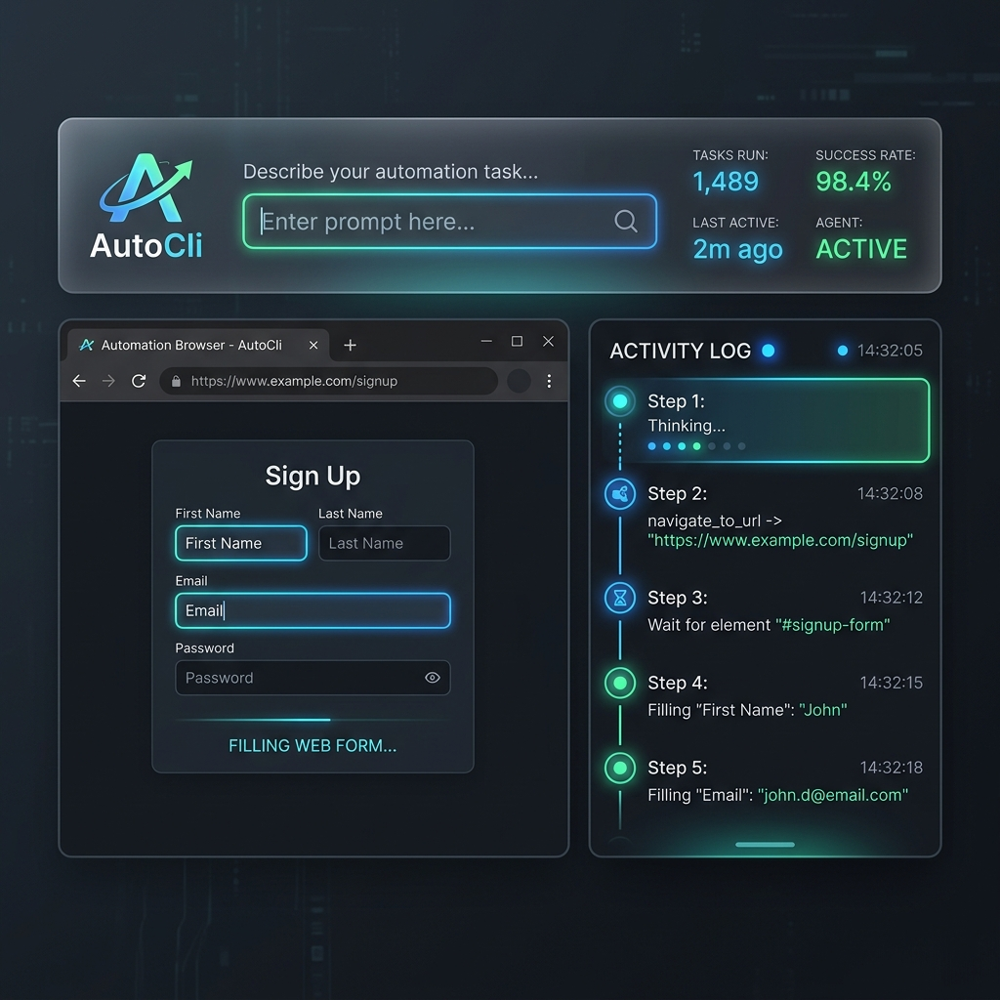

# 🤖 AutoCli — AI-Powered Browser Automation Agent

[](https://autocliagent.onrender.com)
[](https://www.python.org/)
[](https://playwright.dev/)

An intelligent browser automation agent that navigates web pages, interacts with elements, and fills forms autonomously. Built with **Python**, **Playwright**, **FastAPI WebSockets**, and **Groq (Llama 3.3 70B)**.

> 🌐 **Live Web App:** [https://autocliagent.onrender.com](https://autocliagent.onrender.com)  
> 💡 **Assignment 04** — Website Automation Agent demonstrating AI-driven browser control.

### 🖥️ Live Control Panel & Action Timeline

Below is a preview of the **AutoCli Live Control Panel** dashboard. Recruiters can enter any natural language browser automation task, hit **Run Task**, and watch the AI agent think, execute browser tools, and stream screenshots live via WebSockets.



---

## ✨ Features

- **AI-Driven Decision Making** — Uses Llama 3.3 70B via Groq for intelligent page understanding and action planning
- **Live Web Dashboard** — Control and observe the agent dynamically from a WebSocket-powered Web Control Panel
- **Real Browser Automation** — Controls Chromium via Playwright (runs headlessly in production on Render, headed locally for debugging)
- **DOM-Based Element Detection** — Extracts interactive elements with coordinates, labels, and state from the live page
- **ReAct Agent Loop** — Think → Act → Observe cycle for multi-step task completion
- **7 Modular Tools** — `take_screenshot`, `open_browser`, `navigate_to_url`, `click_on_screen`, `send_keys`, `scroll`, `double_click`
- **Rich CLI Interface** — Beautiful terminal output with step tracking, spinners, and color-coded results
- **Error Recovery** — Handles rate limits, missing elements, and navigation failures gracefully
- **Screenshot Logging** — Captures the browser state at each step for debugging and verification

---

## 🏗️ Architecture

```
┌─────────────────────────────────────────────────┐
│                  User Input                      │
│        "Fill the form at this URL"               │
└─────────────────┬───────────────────────────────┘
                  │
                  ▼
┌─────────────────────────────────────────────────┐
│              Agent Loop (ReAct)                  │
│                                                  │
│   ┌──────────┐   ┌──────────┐   ┌──────────┐   │
│   │  THINK   │──▶│   ACT    │──▶│ OBSERVE  │   │
│   │ (Groq    │   │(Execute  │   │(DOM state│   │
│   │  LLM)    │◀──│  tool)   │◀──│+ result) │   │
│   └──────────┘   └──────────┘   └──────────┘   │
│                                                  │
└─────────────────┬───────────────────────────────┘
                  │
                  ▼
┌─────────────────────────────────────────────────┐
│           Playwright Browser                     │
│                                                  │
│   ┌────────────────┐  ┌──────────────────────┐  │
│   │ Browser Manager│  │    DOM Parser         │  │
│   │ (lifecycle)    │  │ (element extraction)  │  │
│   └────────────────┘  └──────────────────────┘  │
└─────────────────────────────────────────────────┘
```

### Module Overview

| Module | Purpose |
|--------|---------|
| `agent.py` | Main entry point — ReAct loop, LLM calls, CLI interface |
| `tools.py` | 7 browser automation tools + tool registry |
| `browser_manager.py` | Playwright browser lifecycle (launch, screenshot, close) |
| `dom_parser.py` | Extracts interactive elements from live DOM via JS injection |
| `prompts.py` | System prompt, tool specs, CLI text, default task |

---

## 🚀 Setup & Installation

### Prerequisites
- Python 3.10+
- A Groq API key (free at [console.groq.com](https://console.groq.com))

### Steps

```bash
# 1. Clone / navigate to the project
cd AutoCli-Agent

# 2. Install Python dependencies
pip install -r requirements.txt

# 3. Install Playwright browsers (downloads Chromium)
playwright install chromium

# 4. Configure your API key
#    Edit .env and paste your Groq API key:
#    GROQ_API_KEY=gsk_your_key_here

# 5. Run the agent
python agent.py
```

---

## 📖 Usage

### Quick Start — Fill the Target Form
```
python agent.py
You > fill
```
This runs the default task: navigate to the shadcn form page and fill in the Username and Bio fields.

### Custom Instructions
```
You > Navigate to https://google.com and take a screenshot
You > Go to https://ui.shadcn.com/docs/forms/react-hook-form and fill the form
You > Scroll down and click on the Submit button
```

### Commands
| Command | Description |
|---------|-------------|
| `fill` | Run the default form-filling task |
| `reset` | Clear conversation & close browser |
| `help` | Show help text |
| `exit` / `q` | Quit the agent |

---

## 🎯 Target Task

The agent is designed to complete this specific task:

1. **Navigate** to `https://ui.shadcn.com/docs/forms/react-hook-form`
2. **Identify** the form elements (Username input + Bio textarea)
3. **Fill** the Username field with "Somvardhan"
4. **Fill** the Bio field with "This is an automated form submission by AutoCli Agent."
5. **Submit** the form
6. **Screenshot** the result

---

## 🛠️ Tools Reference

| Tool | Args | Description |
|------|------|-------------|
| `open_browser` | `{}` | Launch Chromium in headed mode |
| `navigate_to_url` | `{url}` | Go to URL, wait for load |
| `take_screenshot` | `{label}` | Save viewport PNG to screenshots/ |
| `click_on_screen` | `{x, y}` | Click at pixel coordinates |
| `send_keys` | `{text}` | Type text into focused element |
| `scroll` | `{direction, amount}` | Scroll up/down by pixels |
| `double_click` | `{x, y}` | Double-click at coordinates |
| `done` | `{summary}` | Signal task completion |

---

## 📁 Project Structure

```
AutoCli-Agent/
├── agent.py              # Main agent loop + CLI
├── tools.py              # Browser automation tools
├── browser_manager.py    # Playwright lifecycle manager
├── dom_parser.py         # DOM element extractor
├── prompts.py            # LLM system prompt + templates
├── requirements.txt      # Python dependencies
├── .env                  # API keys (gitignored)
├── .env.example          # API key template
├── .gitignore            # Ignore patterns
├── README.md             # This file
├── ARCHITECTURE.md       # Design decisions document
└── screenshots/          # Auto-saved screenshots (gitignored)
```

---


